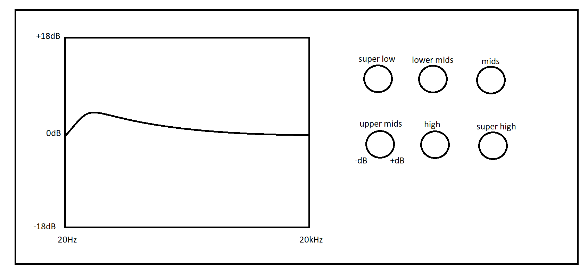

# Gryphon Equalizer

_von Marvin Kästing & Pascal Wegener_

Der Gryphon Equalizer (zusammengesetzt aus den Wörtern Graphic Equalizer und Python) ist ein 10-Band Equalizer, mit
dessen Hilfe beliebige mono Wave Dateien eingelesen und deren Frequenzbänder grafisch manipuliert werden können.

Er ist das Ergebnis des Moduls "Multimediale Signalverarbeitung" der Hochschule Anhalt in Köthen, in dem Studierende ein
Programm entwickeln und programmieren sollten. Die einzige Einschränkung dabei war die thematische Gebundenheit an einen
multimedialen Anwendungsfall.

## Inhalt

1. [Motivation](#motivation)
2. [Ziel](#ziel)
3. [Konzept](#konzept)
4. [Umsetzung](#umsetzung)
5. [Fazit](#fazit)
6. [Future Work](#future-work)

## Motivation

Abgesehen von der extrinsischen Motivation das Modul gut zu bestehen, geht es uns bei diesem Projekt hauptsächlich um
zweierlei Arten von Wissen, die wir erlernen konnten.

Die technischen Aspekte: Die Anwendung der in der Wissenschaft weit verbreiteten Hochsprache Python und seinem numpy
Paket. Python eignet sich für das reine Programmieren von Formeln und der Anwendung von Techniken aus der Vorlesung
besonders gut, da Dinge wie Speicherverwaltung, die nur zu den Eigenheiten der Sprache gehören und nicht für das Wissen
dieses speziellen Moduls vonnöten sind, außen vor gelassen werden. Das Verständnis von mathematischen und
soundtechnischen Eigenheiten lag hier im Vordergrund.

Und ebenfalls das GUI-Design in Python: Das QT Framework ist auch in anderen Sprachen sehr weit verbreitet, was uns
somit einen gewissen Vorsprung in der Unternehmenslandschaft verschafft. Aber auch hier gilt, dass wir uns eher auf die
Logik hinter der GUI und auf das eigentliche Design konzentrieren konnten, anstatt uns mit der Erstellung einer
kompletten Nutzeroberfläche zu beschäftigen.

## Ziel

Unser Ziel war von vornherein ein simples GUI, welches dem Nutzer erlaubt, eine .wav Audiodatei mithilfe von:

- dem visualisierten Frequenzbereich des (bearbeiteten) Eingangssignals,
- dem visualisierten Frequenzbereich des modifizierenden Signals und
- unterschiedlichen Drehreglern, jeder zu bestimmten Teilfrequenzbereichen zugeordnet (z.B. Höhen, Mitten, Tiefen) zur
  Erhöhung/Verringerung der jeweiligen Amplitude

zu bearbeiten und abzuspeichern.

Im Folgenden sind die zu Beginn der Projektphase von uns selbst erstellten Anforderungen an das Endprodukt.  
Diese enthalten sowohl harte Anforderungen, also solche, die wir unbedingt zum Ende des Bearbeitungszeitraums vollendet
haben wollen, als auch nice-to-have Anforderungen, die dem Equalizer durchaus gerecht werden würden, aber von uns als
nicht allzu wichtig eingestuft werden.

### Harte Anforderungen

Der Equalizer soll:

- [x] eine grafische Benutzeroberfläche für einen 10-Band Equalizer enthalten.
- [x] (mono) Wave Dateien einlesen können und:
    - [x] zehn Bänder im Frequenzbereich manipulieren können, sowie
    - [x] abspeichern können.
- [x] mindestens zur Benutzung unter Windows 10 funktionieren.

### Nice-to-Haves

Der Equalizer könnte außerdem:

- [ ] stereo Wave Dateien einlesen.
- [ ] eine Funktion zur Vorschau des (manipulierten) Signals enthalten.
- [ ] einen Mikrofon-Stream:
    - [ ] aufnehmen und abspeichern, sowie
    - [ ] live manipulieren und ausgeben.
- [ ] mittels einer ausführbaren Datei (.exe) benutzbar sein.

## Konzept

Da die Entwicklung von Front- und Backend grundsätzlich gut thematisch getrennt werden kann, haben wir uns die beiden
bei diesem Projekt auch untereinander aufgeteilt und parallel an beiden gearbeitet.

### Frontend (UX Design)

Aus den folgenden Aufgaben des Frontends:

- Auswählen einer (mono) Wave Datei
- Grafisches Manipulieren von 10 Frequenzbändern dieser Signalwerte mittels Drehreglern
    - Anzeigen des veränderten Signals
- Abspeichern der manipulierten Datei

resultiert folgende Skizze:

### Backend (Signaltheorie)

Aus den Aufgaben des Frontends resultieren für das Backend folgende Aufgaben:

- Das Einlesen eines Pfades und das Auslesen der Daten von einer beliebigen (mono) .wav Datei
- Die Fouriertransformation einer beliebigen (mono) Wave Datei in den Frequenzbereich
    - Die Übertragung und Speicherung dieser nicht normierten Werte in
        - eine auf 1 normierte und
        - eine auf Dezibel basierte Skalierung
- Die Manipulation eines Frequenzbandes innerhalb der eingelesen Wave Datei

Prinzipiell haben wir alle nötigen Grundlagen in der Vorlesung behandelt, womit wir das nötige Wissen zur
Signalverarbeitung bereits zur Verfügung haben. Dennoch fehlen uns kleine Details, wie zum Beispiel die Konvertierung in
eine Dezibel Skalierung oder das Auslesen eines Pfades, welches mittels der berühmt-berüchtigten Suchmaschine unserer
Wahl nachgeschlagen wird.

## Umsetzung

Siehe [Quellcode Dokumentation](./docs/index.md)

## Fazit

Das Fazit stellt unsere Zusammenfassung und persönliche Erfahrung zum Arbeitsprozess während der praktischen Phase des
Moduls dar.

### Was wir gelernt haben

Wir haben gelernt, wie man eine grafische Benutzeroberfläche mithilfe von PyQt6 und eigenen Widgets erstellen kann, wie
man diese im QTDesigner erstellt und dann importieren und verändern kann. Auch wie man einen mithilfe eines rudimentären
Rechteckfilters Frequenzbänder auswählen kann, um diese dann weiter zu bearbeiten. Aufgefallen ist uns, wie viele
Faktoren es beim Arbeiten mit Signalen und Sounddateien gibt, dass diese kompatibel zu den eigenen gewünschten Methoden
sind und korrekt genutzt werden, um die Signale nicht ungewollt zu verändern.

### Was wir für zukünftige Projektarbeiten mitnehmen

Was wir von diesem Projekt mitnehmen können, ist genau das, was wir uns anfangs erhofft hatten: das weiter gefestigte
Wissen über die Audiotechnik, das Planen, Organisieren und Implementieren eigener Anwendungen mit Python, sowie der
Umgang mit den verschiedenen genutzten Bibliotheken (numpy, scipy, matplotlib und PyQt6).  
Auch gerade zum Ende des Projekts wurde uns _realitätsnah_ gezeigt, wie wir gleichzeitig Anforderungen im Alltag
nachkommen und Deadlines einhalten müssen. Wir denken, dass dies doch gut auf das spätere Berufsumfeld vorbereitet.

## Future work

Unserer Auffassung nach ist dieses Projekt nur bedingt und eher zur eigenen Übung in der Zukunft nutzbar, da es an sich
keinen Mehrwert bietet. Es gibt bereits einige gute Equalizer und DAWs auf dem Markt, die sogar als open-source Software
vertrieben werden und deutlich effizienter gestaltet sind, als dieses. Dennoch wollen wir hier einen kleinen Ausblick
auf Optionen zur Weiterentwicklung des Equalizers geben.

Mögliche Einstiegspunkte zur weiteren Bearbeitung (ob nun durch uns oder durch ein anderes Team) wurden bereits im
Abschnitt [Nice-to-Haves](#nice-to-haves) genannt. Dazu kämen noch weitere Möglichkeiten zwecks Customization der GUI,
sowie die Erweiterung auf andere Dateiformate, wie z.B. mp3 oder ogg wären durchaus sinnvoll, um dem Nutzer ein größeres
Spektrum an Möglichkeiten zur Bearbeitung seiner Sounddateien zu geben.

Weiterhin wäre aber auch ein Fokus auf die Laufzeitoptimierung oder gar der Wechsel von Python hin zu einer low-level
Programmiersprache (C/C++) denkbar, um diverse Performance-Probleme mit Python loszuwerden und den Equalizer auch
Echtzeit-tauglich zu machen.
